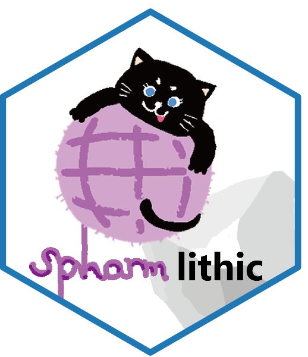

<!-- README.md is generated from README.qmd. Please edit that file -->

# spharmlithic <a href="https://github.com/PeiyuanXiao/spharmlithic"></a>

<!-- badges: start -->

[](https://www.repostatus.org/#wip)
[](https://lifecycle.r-lib.org/articles/stages.html#experimental)
[](https://opensource.org/licenses/MIT)
[](https://cran.r-project.org/)
[](https://github.com/PeiyuanXiao/spharmlithic/actions/workflows/R-CMD-check.yaml)
[](https://app.codecov.io/gh/PeiyuanXiao/spharmlithic)
<!-- badges: end -->

**spharmlithic** is an R package for the quantitative analysis of 3D
stone artefacts. It supports two complementary lines of inquiry:
**artefact morphology** (overall 3D shape from mesh surfaces) and
**flaking scar patterns** (orientation and organisation of flaking
removals). The package brings together two coordinate-alignment
pipelines, descriptive statistics (e.g. SPI, Elongation/Isotropy),
interactive 3D visualisation, and a Python back-end for spherical
harmonic decomposition — all in a single, script-based workflow.

Documentation: <https://peiyuanxiao.github.io/spharmlithic/>

------------------------------------------------------------------------

### 📦 Installation

#### Option A — Install from R

``` r
# Step 1: Install the R package
# install.packages("remotes")
remotes::install_github("PeiyuanXiao/spharmlithic")

# Step 2: Install the Python back-end (only needed for spherical harmonics)
library(spharmlithic)
install_spharmlithic_python()              # scar pattern analysis
install_spharmlithic_python(mesh = TRUE)   # also enables morphological analysis
```

On subsequent R sessions, activate the environment with:

``` r
use_spharmlithic_python("r-spharmlithic")
```

> **Note:** A working
> [conda](https://docs.conda.io/en/latest/miniconda.html) installation
> is required. If conda is not on your system PATH, add
> `Sys.setenv(RETICULATE_CONDA = "path/to/conda")` to your
> `~/.Rprofile`.

#### Option B — Docker (recommended for mesh analysis on macOS)

A pre-built Docker image includes R, RStudio Server, and the full Python
environment. On macOS the direction-vector pipeline works in a native
installation, but `spharm_from_meshes()` does not: the OpenMP runtime
bundled with `open3d` clashes with the one that comes with R, which
aborts the R session with `OMP: Error #15`. Use Docker there.

``` bash
docker pull peiyuanxiao/spharmlithic
docker run -d -p 8787:8787 \
  -v /path/to/your/data:/home/rstudio/data \
  peiyuanxiao/spharmlithic
```

Open `http://localhost:8787` in your browser (user: `rstudio`, password:
`rstudio`). Example data and a quick-start script are pre-loaded in
`~/examples/`.

------------------------------------------------------------------------

### 🚀 Quick Start

``` r
library(spharmlithic)
library(readxl)
use_spharmlithic_python("r-spharmlithic")

# ── Scar pattern analysis ─────────────────────────────────
scar_path <- system.file("extdata", "example_scars.xlsx",
                          package = "spharmlithic")
raw_data  <- read_excel(scar_path)
aligned   <- align_scar_batch(raw_data)

compute_spi(aligned$d_x, aligned$d_y, aligned$d_z)
compute_ei(aligned$d_x, aligned$d_y, aligned$d_z)

sh_scar <- spharm_from_directions(aligned, lmax = 20)

# ── Morphological analysis ────────────────────────────────
stl_dir  <- system.file("extdata", "meshes", package = "spharmlithic")
sh_morph <- spharm_from_meshes(stl_dir, lmax = 20)

# ── Interactive viewer ────────────────────────────────────
export_spharm_html(morph = sh_morph, scar = sh_scar,
                   out_path = "spharm_viewer.html")
```

------------------------------------------------------------------------

### 🔧 Function Reference

#### Alignment

| Function | Description |
|:---|:---|
| `align_scar_batch()` | SVD three-step alignment of scar orientation vectors |
| `align_morph_batch()` | Two-step alignment following Lin et al. (2024) |

#### Descriptive Statistics

| Function | Description |
|:---|:---|
| `compute_spi()` | Scar Pattern Index (length-weighted: Clarkson et al., 2006; non-weighted: Bretzke & Conard, 2012) |
| `compute_spi_angle()` | Angular conversion of SPI (`θ = arccos(SPI)`) |
| `compute_ei()` | Elongation and Isotropy ratio from Lin et al. (2024) |
| `get_scar_length()` | Individual scar lengths from coordinate data |

#### Spherical Harmonic Analysis

| Function                   | Description                                   |
|:---------------------------|:----------------------------------------------|
| `spharm_from_directions()` | SH coefficients from scar orientation vectors |
| `spharm_from_meshes()`     | SH coefficients from 3D mesh surfaces         |
| `spharm_to_dataframe()`    | Convert results to a wide-format data frame   |

#### Export & Visualisation

| Function | Description |
|:---|:---|
| `export_spharm_html()` | Interactive Three.js viewer for SH reconstructions |
| `export_alignment_html_svd()` | SVD alignment as self-contained HTML |
| `export_alignment_html_lin2024()` | Lin et al (2024) alignment as self-contained HTML |

#### Python Environment

| Function                        | Description                      |
|:--------------------------------|:---------------------------------|
| `install_spharmlithic_python()` | Create the conda environment     |
| `use_spharmlithic_python()`     | Activate an existing environment |

For detailed usage, see the two vignettes:
`vignette("Introduction", package = "spharmlithic")` (from artefacts to
spherical harmonic coefficients) and
`vignette("Statistics", package = "spharmlithic")` (PCA, PERMANOVA, and tests
of standardisation on the results).

------------------------------------------------------------------------

### 📖 References

Bretzke, K., & Conard, N. J. (2012). Evaluating morphological
variability in lithic assemblages using 3D models of stone artifacts.
*Journal of Archaeological Science*, 39(12), 3741–3749.
<https://doi.org/10.1016/j.jas.2012.06.039>

Clarkson, C., Vinicius, L., & Lahr, M. M. (2006). Quantifying flake scar
patterning on cores using 3D recording techniques. *Journal of
Archaeological Science*, 33(1), 132–142.
<https://doi.org/10.1016/j.jas.2005.07.007>

Lin, S. C., Clarkson, C., Julianto, I. M. A., Ferdianto, A., Jatmiko, &
Sutikna, T. (2024). A new method for quantifying flake scar organisation on cores
using orientation statistics. *Journal of Archaeological Science*, 167,
105998. <https://doi.org/10.1016/j.jas.2024.105998>

McPherron, S. P. (2018). Additional statistical and graphical methods
for analyzing site formation processes using artifact orientations.
*PLoS ONE*, 13(1), e0190195.
<https://doi.org/10.1371/journal.pone.0190195>

Wieczorek, M. A., & Meschede, M. (2018). SHTools: Tools for working with
spherical harmonics. *Geochemistry, Geophysics, Geosystems*, 19(8),
2574–2592. <https://doi.org/10.1029/2018GC007529>

Xiao, P. Y., Li, H., & Marwick, B. (2027). Characterizing core
morphology and scar patterning within a unified spherical harmonic
framework. *Journal of Archaeological Method and Theory*, 34, 16.
<https://doi.org/10.1007/s10816-026-09828-7>

Ye, Z., Pei, S. W., Ma, D. D., Li, H., & Marwick, B. (2026). Spherical
harmonic analysis of faceted spheroids identifies shaping strategies and
standardisation at Qianshangying (North China). *Journal of
Archaeological Science*, 190, 106551.
<https://doi.org/10.1016/j.jas.2026.106551>

------------------------------------------------------------------------

### 📝 Citation

If you use **spharmlithic** in your research, please cite it as:

> Xiao, P. Y., Marwick, B. (2026). spharmlithic: Spherical Harmonic
> Analysis of Lithic Morphology and Flaking Scar Patterns. R package.
> https://github.com/PeiyuanXiao/spharmlithic

------------------------------------------------------------------------

### ⚖️ License

This project is licensed under the **MIT License** — see the
[LICENSE](LICENSE) file for details.
